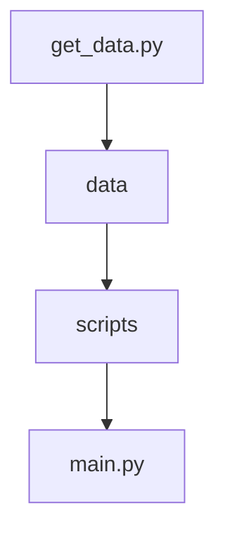

# Projet 

Réseau social étudiant, pensé pour aider les étudiants à s'intégrer à la vie associative de l'école.
Fontionnalités : 
  - Feed -> Voir tous les posts des clubs
  - Clubs & Assos -> Voir toutes les associations et clubs de l'école
  - Messages -> Pouvoir discuter avec ses amis
  - Calendrier -> Pour accéder à son calendrier personnalisable

# Arborescence (mermaid)


# Démo
Accessible sur : [nexus.maximelombardo.com](https://nexus.maximelombardo.com)

# Exécution en local
1. Installer [Python](https://www.python.org/) >= 3.6

2. Cloner le projet
```bash
git clone https://github.com/MathisPipart/Nexus.git
```
3. Créer un environnement virtuel
```bash
python -m venv venv
```
4. Activer l'environnement virtuel
```bash
source venv/bin/activate
```
5. Installer les dépendances
```bash
pip install -r requirements.txt
```
6. Lancer le serveur
```bash
python manage.py runserver
```
7. Accéder à l'application sur http://localhost:8000
